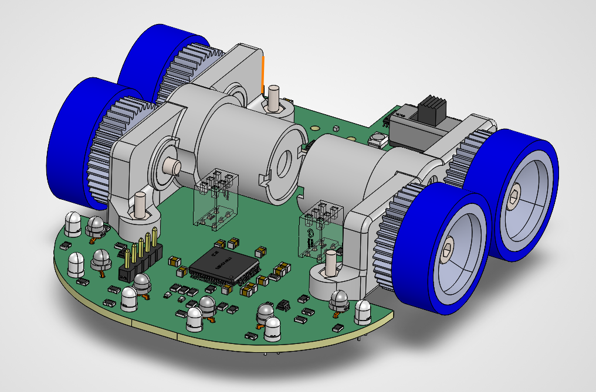
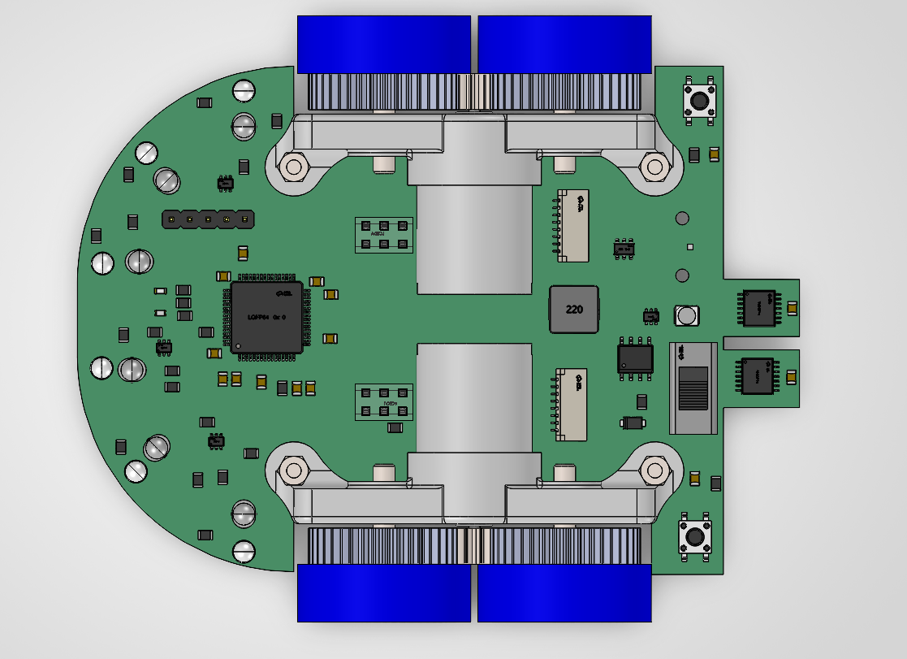
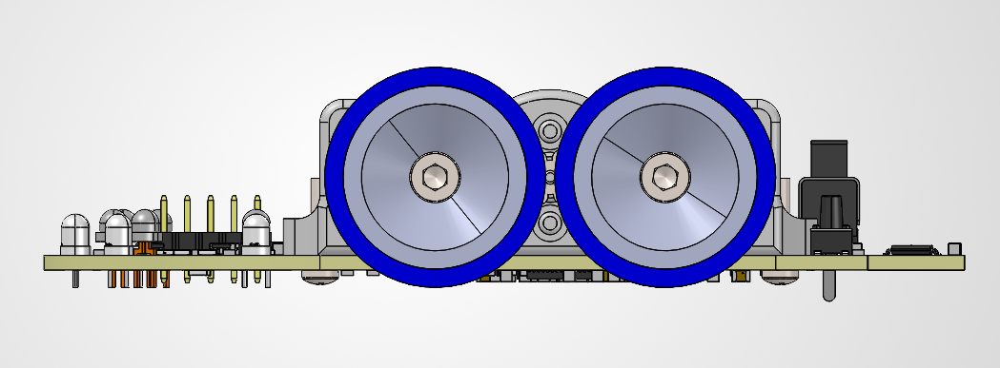

<p align="center">
  
</p>

<h1 align="center">MICROMOUSE</h1>

<p align="center">
  Firmware for a custom four-wheel-drive micromouse robot, built around an STM32F405 and a pair of
  field-oriented-controlled brushless motors.
</p>

---

## Overview

This repository holds the embedded firmware and hardware reference documentation for a micromouse — a
small autonomous robot that maps and solves a maze as fast as possible. The board integrates motor
drive, motion sensing, and wall detection on a single round PCB that doubles as the chassis.

The firmware targets an **STM32F405RGT6** running at 168 MHz and is built with CMake + Ninja using the
`arm-none-eabi` GCC toolchain, generated from an STM32CubeMX/CubeIDE project.

## Hardware

| Top view | Side view |
|---|---|
|  |  |

Key subsystems, driven from the pin map in [F405_CubeMX_pinmap.md](F405_CubeMX_pinmap.md):

- **MCU** — STM32F405RGT6 (Cortex-M4, 168 MHz, HSI → PLL, no external crystal), debugged over SWD.
- **Drive** — Two `DRV8316` three-phase gate drivers (SPI-configured, 3× PWM mode) driving the front
  and rear motor pairs, with center-aligned PWM on `TIM1` (master) and `TIM8` (slave, synced via ITR0)
  and per-phase current sensing on injected ADC channels.
- **Encoders** — Two `AS5047P` magnetic rotary encoders on `SPI1` for wheel odometry.
- **IMU** — `ICM-42670-P` 6-axis IMU on `SPI2`, shared with the motor drivers, for yaw/heading and
  motion feedback.
- **Wall sensing** — Six IR emitter/receiver pairs, pulsed and sampled through the ADC, for detecting
  maze walls.
- **Power** — `TPS563201DDCR` buck converter regulating battery voltage down to logic rails, with
  battery-voltage sensing on the ADC.
- **UI** — RGB status LED, a PWM-driven tail light, a buzzer, and start/mode buttons.

> [!NOTE]
> The full schematic is available at [image/Schematic1.png](image/Schematic1.png).

## Repository layout

```
Core/                    Application and HAL configuration (main.c, IRQ handlers, system init)
Drivers/                 CMSIS device headers and STM32F4xx HAL driver sources
cmake/                   Toolchain, target, and build configuration for CMake
image/                   Renders and schematic of the board
F405_CubeMX_pinmap.md    Full pin-by-pin reference for the STM32F405 (clocks, timers, ADC, SPI, GPIO)
STM32F405RGTX_FLASH.ld   Linker script for the target's flash/RAM layout
CMakeLists.txt           Top-level build definition
```

## Getting started

### Prerequisites

- [CMake](https://cmake.org/) ≥ 3.20 and [Ninja](https://ninja-build.org/)
- An `arm-none-eabi-gcc` toolchain
- An ST-Link probe for flashing/debugging (or STM32CubeIDE / the VS Code STM32 extension, which are
  already configured in [.vscode/launch.json](.vscode/launch.json))

### Build

```bash
cmake --preset Debug
cmake --build --preset Debug
```

Swap `Debug` for `Release` to build an optimized image. Build presets are defined in
[CMakePresets.json](CMakePresets.json); the resulting `MICROMOUSE.elf` is placed under
`build/<preset>/`.

### Flash and debug

Open the folder in VS Code with the STM32 extension installed and launch **STM32Cube: Launch ST-Link
GDB Server**, or flash `MICROMOUSE.elf` with STM32CubeProgrammer / `st-flash`.

## Firmware status

The current [main.c](Core/Src/main.c) is bring-up/test code: it wakes the gate drivers
(`NSLEEP`/`DRVOFF`), then cycles the status LED and tail light to verify GPIO and power-rail wiring.
Motor commutation (FOC), encoder reading, IMU fusion, IR wall detection, and maze-solving logic are not
yet implemented.

> [!TIP]
> Start from the [pin map](F405_CubeMX_pinmap.md) when adding a new peripheral driver — it documents
> the CubeMX configuration (mode, alternate function, and any hardware bodges) for every pin in use.
